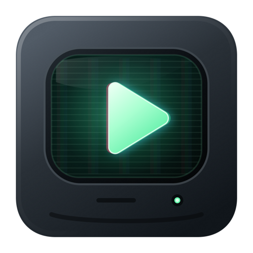

<p align="center">
  
</p>

<h1 align="center">Phosphor</h1>

<p align="center">
  <strong>A CRT television, living inside your Mac.</strong><br>
  Real phosphors, electron-beam behavior, glow, persistence, and curved glass—<br>
  rebuilt in native Metal and hyper-optimized for Apple silicon.
</p>

<p align="center">
  
  
  
  
</p>

<p align="center">
  <a href="https://github.com/JoAz111/Phosphor/releases/latest"><strong>Download Phosphor</strong></a> ·
  <a href="#build-from-source">Build from source</a> ·
  <a href="#how-it-works">How it works</a> ·
  <a href="#fidelity-and-roadmap">Fidelity</a>
</p>

---

Drop in a video and Phosphor turns your Mac into a beautifully imperfect CRT.
It does not place a scanline texture over the picture. It reconstructs every
frame as a virtual tube would: a finite electron-beam raster, brightness-
dependent beam shapes, discrete RGB phosphors, temporal persistence, diffuse
light, and curved glass.

It is native from end to end—SwiftUI and AppKit for the interface, AVFoundation
for playback, and a multi-pass Metal renderer for the tube. The result looks
computationally extravagant, but runs like butter without making Apple silicon
break a sweat.

> [!IMPORTANT]
> Phosphor is an early FOSS preview. The physical CRT path is working,
> but it is a reference-informed simulation rather than a measurement of one
> particular tube. See [Fidelity and roadmap](#fidelity-and-roadmap) for the
> honest boundary.

## A CRT, not a filter

- **Individual RGB phosphors.** Choose a continuous aperture grille, a true
  two-dimensional slot-mask lattice, or offset shadow-mask dots. Slot mode draws
  separate rounded R/G/B deposits, a black matrix in both axes, and vertically
  staggered neighboring triads. Shadow mode draws discrete delta-gun-style dot
  triads. On Retina displays, all patterns use physical pixels—not SwiftUI
  points.
- **Beams that react to the picture.** Dark detail produces narrow scanlines;
  bright areas excite wider, softer beams instead of receiving identical black
  stripes.
- **A raster with time.** 240p is progressive; 480i alternates fields. Every
  physical pixel gets an analytical excitation time from its horizontal
  position, scanline, field phase, active interval, blanking, and flyback. The
  beam advances between display presentations instead of stamping the whole
  image at once.
- **Light with a memory.** A native-resolution excitation buffer analytically
  integrates short, separate R/G/B emission curves. Local source-discontinuity
  rejection prevents moving objects and hard cuts from dragging stale colored
  light behind them, while glow, bloom, and warm faceplate scatter spread light
  through the tube.
- **Analog inputs.** Select clean RGB, bandwidth-limited S-Video, NTSC composite,
  or PAL composite. Composite modes encode a 4×-subcarrier active-picture
  waveform, modulate YIQ or YUV with line/frame phase, apply distinct luma and
  chroma bandwidth, then decode through a selectable notch or line-comb filter.
- **Color-managed HDR.** PQ, HLG, BT.2020, Display P3, and 10-bit video-range
  metadata survive decode. The renderer linearizes the source, maps it into the
  chosen tube response, and emits through the Mac display's available EDR
  headroom.
- **Built to run like butter.** Hardware-decoded frames enter Metal through
  `CVPixelBuffer` surfaces and remain on the GPU through the CRT graph. Phosphor
  reconstructs the tube only when the video produces a new frame.

## Looks heavy. Runs light.

Phosphor is hyper-optimized around the architecture of Apple silicon. Video
frames become Metal textures through `CVMetalTextureCache`; the complete CRT
graph is encoded into one command buffer; intermediate images remain in private
GPU textures; and the final `CAMetalLayer` is framebuffer-only. There is no CPU
readback in the playback path.

Rendering uses two deliberately different clocks. A 24 fps movie gets 24 costly
source-reconstruction updates per second. That work produces a cached,
native-resolution tube-emission texture. A much lighter half-precision temporal
pass follows the Mac display—up to 120 Hz or beyond—to advance channel-specific
phosphor decay without rerunning the full graph for duplicate video frames.
Excitation history uses Apple's compact `RG11B10Float` format where supported,
the wide glow kernel is folded into paired bilinear samples, mask variants are
specialized up front, and in-flight work is deliberately bounded. The current
and previous decoded frames are retained only for local motion-discontinuity
rejection; the obsolete source-frame afterglow target and its extra render write
are gone.

Phosphor also measures the final pass with Metal's GPU timestamps. If a display
cadence is genuinely unsustainable, it settles on a stable lower presentation
rate instead of building latency or stuttering, then restores high refresh
after sustained headroom. Occluded windows stop presenting entirely.

That is how Phosphor can simulate a beam, persistence, bloom, glow, individual
RGB phosphors, and curved glass in real time while still feeling like a tiny,
effortless native Mac app—not a GPU benchmark wearing video-player controls.

## Play almost anything

QuickTime-compatible media opens directly through AVFoundation. Matroska, AVI,
WebM, and uncommon codecs fall back to FFmpeg's libraries inside Phosphor. The
decoder reads the original file directly into a bounded in-memory frame queue,
prefers VideoToolbox hardware decoding, and sends audio straight to
`AVAudioEngine`.

**Phosphor never invokes the `ffmpeg` command, remuxes the video, converts it,
or creates a prepared playback copy.** The original file is the only media file
it reads.

## Build from source

You will need an Apple Silicon Mac, macOS 14 or later, Xcode with the Metal
toolchain, and FFmpeg's development libraries for a quick local build.

```sh
git clone https://github.com/JoAz111/Phosphor.git
cd Phosphor
brew install ffmpeg
./script/build_and_run.sh
```

The script creates an optimized, ad-hoc-signed app at `dist/Phosphor.app` and
launches it. The app icon, compiled Metal library, Sparkle updater, compatible
FFmpeg libraries, file declarations, and license notices live inside that
`.app`; the resulting bundle does not need Homebrew on the destination Mac.

### Build a signed GitHub release

The release builder downloads and checksum-verifies pinned FFmpeg 8.1.2 source,
builds only its local playback libraries for arm64/macOS 14, links them
statically into Phosphor, signs Sparkle and all of its nested helpers inside-out,
enables the hardened runtime, and creates an APFS/LZFSE disk image with an
`/Applications` link. The version and monotonically increasing build number are
explicit:

```sh
./script/build_release.sh 0.1.0 1
```

The script automatically selects the installed `Developer ID Application`
identity. It produces `dist/Phosphor-0.1.0.dmg` and an Ed25519-signed
`dist/appcast.xml`. A build without a notary profile is useful for local release
validation but must not be published.

For public distribution, save your notarization credentials once. This command
prompts securely for an app-specific password rather than putting it in shell
history:

```sh
xcrun notarytool store-credentials "phosphor-notary" \
  --apple-id "you@example.com" \
  --team-id "YOURTEAMID"
```

Then build, notarize, staple, validate through Gatekeeper, and generate the
Sparkle appcast in one pass:

```sh
./script/build_release.sh 0.1.0 1 "phosphor-notary"
```

To publish both assets as a GitHub Release after committing the release source:

```sh
./script/publish_release.sh 0.1.0 1 "phosphor-notary"
```

Phosphor’s feed lives at the latest GitHub Release’s `appcast.xml` asset. Every
update is protected independently by Apple Developer ID signing and Phosphor’s
dedicated Sparkle Ed25519 key. The private updater key remains in the developer
Keychain; back it up securely with Sparkle’s `generate_keys -x` option before
shipping the first release. The release contains no FFmpeg executable and no
non-system media-library dependency.

Useful development modes:

```sh
./script/build_and_run.sh --verify    # launch and verify the process
./script/build_and_run.sh --debug     # build debug and attach LLDB
./script/build_and_run.sh --logs      # stream app logs
./script/build_and_run.sh --telemetry # stream Phosphor subsystem logs
```

## Using Phosphor

- Open a video with **Command-O**, drag and drop, **File → Open Video**, or
  **Open With → Phosphor** in Finder.
- Play or pause with **Space**.
- Choose **Phosphor → Check for Updates…** to query the signed GitHub Releases
  appcast.
- Seek and change volume from the floating player controls.
- Use **Bypass CRT Effect** for an immediate source comparison.
- Choose a Consumer TV, Trinitron, or Studio Monitor tube profile in **Advanced
  CRT Settings**, then tune raster mode, analog signal, notch/comb decoding,
  stable or low-persistence motion, convergence, focus, curvature, scanlines,
  mask, glow, and vignette. Low Persistence activates only on displays capable
  of at least 100 Hz.
- Enter full screen with the standard macOS window control.

## How it works

```text
AVFoundation or in-process FFmpeg decode
  → tagged 8-bit, 10-bit, or linear half-float CVPixelBuffer
  → CVMetalTextureCache input
  → source transfer-function and gamut conversion into virtual CRT drive
  → RGB / S-Video path, or 4fsc NTSC/PAL waveform encode + notch/comb decode
  → current/previous decoded frames for local motion rejection
  → color prepass
  → Guest 1.8-gamma linearization
  → horizontal reconstruction
  → folded glow and bloom diffusion
  → cached native-resolution tube emission with aperture, slot, or shadow mask
  → analytical horizontal/vertical beam timing with blanking and flyback
  → display-rate, time-integrated RGB phosphor excitation and decay
  → EDR-aware halation, faceplate scatter, curved glass, and CAMetalLayer
```

The Metal graph is based on
[CRT-Guest-Advanced HD](https://github.com/libretro/slang-shaders/tree/master/crt/shaders/guest/hd)
and adapted for AVFoundation video, interlaced field metadata, a variable window
size, Retina backing pixels, and Apple Silicon GPUs. A true one-pass bypass
remains separate from the CRT graph.

## Fidelity and roadmap

The current renderer ports Guest Advanced HD's core signal path: source history,
color prepass, 1.8-gamma linearization, reconstruction filters, luminance-driven
beam response, glow/bloom stages, brightness compensation, and the final mask.
Phosphor adds analytical horizontal and vertical electron-beam timing, automatic
field metadata plus explicit 240p/480i modes, native-resolution channel-specific
phosphor decay, oversampled composite encode/decode, HDR input and EDR emission,
tube profiles, edge focus, and convergence error.

Phosphor includes Guest's type 6 RGB aperture grille and a separately modeled
slot-mask lattice plus a genuine offset dot-triad shadow mask. The slot mask is
not grille output with horizontal bars: each RGB deposit has its own rounded
aperture and surrounding black matrix, and alternating triads are offset
vertically. Bright emitters grow into the matrix the way an energized beam spot
grows on a tube.

The Consumer TV, Trinitron, and Studio Monitor profiles are coherent,
historically informed parameter sets—not measurements of named physical units.
The mask system exposes pitch, emitter dimensions, black matrix, staggering,
grille-wire width, and brightness-dependent spot growth internally, so real
measurement packs can replace the reference values without rewriting the
renderer. Likewise, NTSC and PAL now travel through an oversampled active-video
waveform, but Phosphor does not yet simulate an RF tuner, IF stages, sync pulses,
or a noisy broadcast channel.

Still to come:

- Pixel-parity fixtures captured from a pinned RetroArch reference renderer
- Measurement packs captured from real reference tubes and macro photography
- Optional color LUTs and additional historical mask geometries
- RF/IF input, sync instability, and service-menu controls

## Development

Run the complete test suite with:

```sh
DEVELOPER_DIR=/Applications/Xcode-beta.app/Contents/Developer \
  swift test --scratch-path "${TMPDIR:-/tmp}/phosphor-swiftpm-tests"
```

The suite includes live-GPU checks for every Metal entry point, Guest's input
gamma, channel-specific phosphor decay, alternating interlaced fields,
luminance-dependent raster lines, within-scanline beam timing, aperture/slot/dot
phosphors and black matrices, 4fsc composite encode/decode, HDR metadata and
10-bit range conversion, adaptive GPU budgeting, and true bypass. It also
decodes a real Matroska file through the in-process FFmpeg path and verifies that
playback creates no prepared media.

<details>
<summary>Project structure</summary>

```text
Sources/Phosphor/
  App/          Application entry point and identity
  Models/       Rendering and playback value types
  Rendering/    CAMetalLayer integration, frame graph, and color conversion
  Resources/    Metal shaders and application icon
  Stores/       AVFoundation and direct FFmpeg playback state
  Views/        SwiftUI controls and AppKit/Metal bridge
Tests/          CPU and live-GPU regression tests
script/         Build, bundle, launch, and debugging entry point
```

</details>

## License and credits

Phosphor is free software under the
[GNU General Public License, version 2 or any later version](LICENSE).

The renderer is a modified Metal/macOS adaptation of
[CRT-Guest-Advanced HD](https://github.com/libretro/slang-shaders/tree/master/crt/shaders/guest/hd),
copyright © 2018–2025 guest(r), with ideas and contributions from Dr. Venom and
the Libretro shader community. The current translation is based on upstream
commit [`3b0d6aa`](https://github.com/libretro/slang-shaders/commit/3b0d6aa1d134a168478cd9c904a866d969f8882b).
Portions of the mask logic originate in Timothy Lottes' public-domain CRT shader.

Phosphor links FFmpeg's `libavformat`, `libavcodec`, `libavutil`, `libswscale`,
and `libswresample` libraries for compatibility playback. Release builds pin
FFmpeg 8.1.2 and reproduce the exact library configuration in
`script/build_ffmpeg.sh`; see [ffmpeg.org](https://ffmpeg.org/) for its source
and LGPL license information. FFmpeg remains a separate third-party project and
is not endorsed by or affiliated with Phosphor.

Phosphor uses [Sparkle](https://sparkle-project.org/) 2.9.4 for secure updates
from GitHub Releases. Sparkle is redistributed under its permissive license,
included inside the application bundle.
